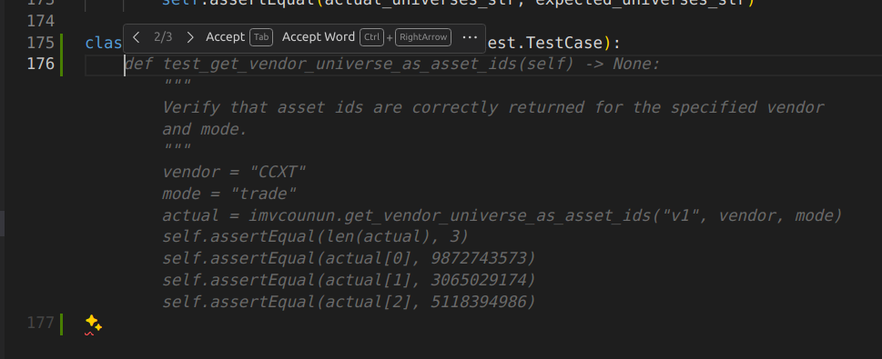
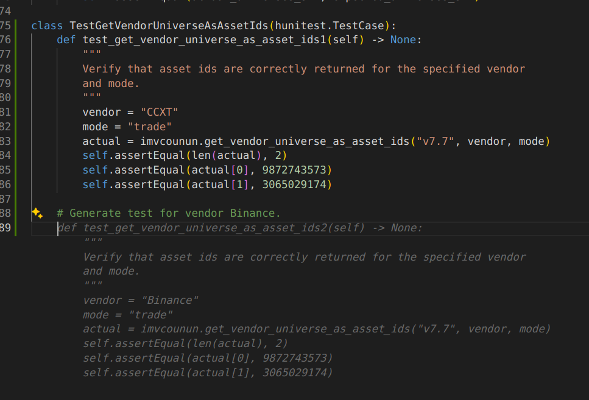
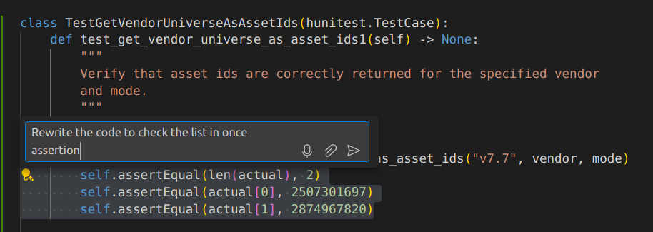
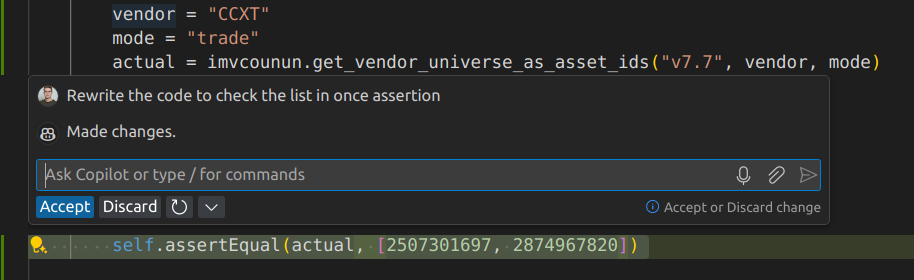

<!-- toc -->

- [Improve productivity using AI](#improve-productivity-using-ai)
  * [GitHub Copilot](#github-copilot)
    + [Confirm you have access to a license](#confirm-you-have-access-to-a-license)
    + [VSCode set-up](#vscode-set-up)
    + [Copilot Code suggestions](#copilot-code-suggestions)
    + [Copilot Chat](#copilot-chat)
    + [Tips & Tricks](#tips--tricks)

<!-- tocstop -->

# Improve productivity using AI

The goal of this guide is to inspire users to be more productive using AI tools,
successfully accomplish initial set-up. For detailed documentation follow the
suggested links.

## GitHub Copilot

### Confirm you have access to a license

1. Visit https://github.com/settings/copilot
2. The page should read that **GitHub Copilot Business is active for your
   account**
   - If not, contact the Infra team / GP

### VSCode set-up

1. Open a new VSCode window and open the extensions marketplace with
   `CMD + Shift + X`
2. Install 2 extensions
   - GitHub Copilot
   - GitHub Copilot Chat
3. VSCode might prompt you to sign in using your GH account via a notification
   window in the bottom right, unless you are already signed in
   - You can also sign in by clicking the "Accounts" button in the bottom left
     of the window

- Reference document: https://code.visualstudio.com/docs/copilot/setup

- After successfully logging in, Copilot should automatically start suggesting
  code
  - If it doesn't visit the troubleshooting page
    https://docs.github.com/en/copilot/troubleshooting-github-copilot/troubleshooting-common-issues-with-github-copilot

### Copilot Code suggestions

- Reference document:
  https://docs.github.com/en/copilot/using-github-copilot/getting-code-suggestions-in-your-ide-with-github-copilot

- The following steps will provide an example for resolution of issue
  https://github.com/cryptokaizen/cmamp/issues/9451 using GitHub Copilot
- In this GH issue we want to add tests for the function
  `im_v2/common/universe/universe.py::get_vendor_universe_as_asset_ids`
- Go to the file `im_v2/common/universe/test/test_universe.py`
  - If there is a test called `Test_get_vendor_universe_as_assert_ids` you can
    delete it for this example

- For example, suppose we want to add new test cases, typing
  `class Test_get_vendor_universe_as_assert_ids(` and Copilot suggests code
  

- We can use the mouse to control the generated code or use
  - `TAB` accepts the suggestion
  - `Control + →` will accept only the next word (useful if the suggested code
    is only "kind-of" correct)
  - `Alt + [` / `Alt + ]` show previous / next suggestion, since usually Copilot
    generates multiple ones
  - For a full list of shortcuts refer to the reference docs in the note above

- It is also possible to describe a test in natural language
  

### Copilot Chat

- Reference document:
  https://docs.github.com/en/copilot/using-github-copilot/asking-github-copilot-questions-in-your-ide

1. You can access the chat in the activity bar on the left
   - If you don't see the icon, right-click on the activity bar and enable
     "Chat"

2. Apart from the general ChatGPT like capabilities, Copilot chat offers unique
   features related to coding
   - **Chat participants**
     - `@workspace` has context about the code in the current workspace, this
       helps Copilot consider the project structure
     - You can also specify "this file" when engineering a prompt for the tab
       you have opened
   - **Chat context**
     - You can use so-called chat variables to include more context; a chat
       variable is accessed via `#`,
       - `#file` adds additional context from a given file
         - E.g. `#file:im_v2/common/data/universe.py`
   - **Slash commands**
     - Provide shortcuts to commonly used features
       - E.g. `/tests` to generate unit tests for the selected code

3. For a quick suggestion, you can use inline chat using current line or a
   selection and `CMD + i`
   
   

4. Right clicking in a window or on a selection `Copilot` offers quick actions
   of Copilot similar to slash commands, such as:
   - `Explain this`
   - `Fix this`
   - `Generate docs`
   - `Generate tests`

### Tips & Tricks

- The entry point of the GitHub copilot documentation is
  https://docs.github.com/en/copilot
- Tips on prompt engineering:
  https://docs.github.com/en/copilot/using-github-copilot/prompt-engineering-for-github-copilot
- Example prompts:
  https://docs.github.com/en/copilot/using-github-copilot/example-use-cases/example-prompts-for-copilot-chat

- For detailed documentation of integrating VSCode and Copilot:
  https://code.visualstudio.com/docs/copilot/overview
