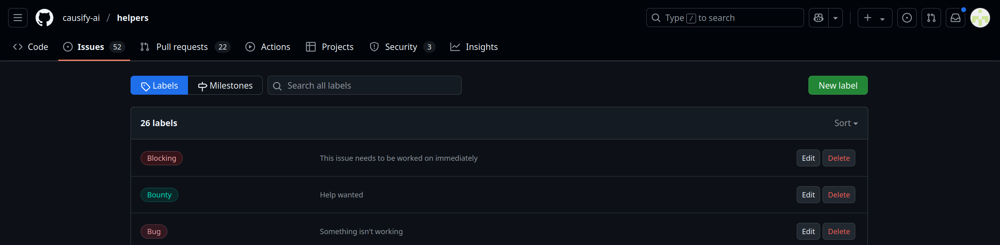

# Synchronize GH issue labels

<!-- toc -->

- [Overview](#overview)
- [Prerequisites](#prerequisites)
  * [Label file](#label-file)
  * [Permissions and access](#permissions-and-access)
- [How to synchronize issue labels](#how-to-synchronize-issue-labels)
  * [Using GitHub](#using-github)
  * [Running the script manually](#running-the-script-manually)
  * [Using Invoke](#using-invoke)

<!-- tocstop -->

## Overview

- GitHub labels help categorize and prioritize issues in a repository. You can
  find more information in the
  [`all.use_github.how_to_guide.md`](/docs/work_organization/all.use_github.how_to_guide.md#label)

- The
  [`/dev_scripts_helpers/github/sync_gh_issue_labels.py`](/dev_scripts_helpers/github/sync_gh_issue_labels.py)
  script synchronizes GitHub issue labels between a repository and a label
  inventory manifest file

- The script includes options to back up existing labels before synchronization
  to prevent data loss

- The labels are stored in the
  [`/dev_scripts_helpers/github/labels/gh_issues_labels.yml`](/dev_scripts_helpers/github/labels/gh_issues_labels.yml)
  file, which acts as a manifest for synchronization. You can create your own
  label file or use the default ones provided in the repository but you need to
  use only YAML file

## Prerequisites

### Label file

- A GitHub label includes the following attributes:
  - `name`: The label's name
  - `color`: The label's color in hex format (e.g., `#FF0000` for red)
  - `description`: A short description of the label

- The `dev_scripts_helpers/labels/gh_issues_labels.yml` file contains various
  label types, as shown below:

```yaml
# Priority Labels.
- name: P0
  description: High priority - needs immediate attention
  color: "#ff0000"
# Issue Types.
- name: Blocking
  description: This issue needs to be worked on immediately
  color: "#e11d21"
# Pull Request Guidelines.
- name: PR for authors
  description: The PR needs changes
  color: "#eb35f3"
# Issue Status.
- name: Paused
  description: An issue was started and then stopped
  color: "#cccccc"
# Contribution Types.
- name: Good first issue
  description: Simple tasks for newcomers
  color: "#7057ff"
```

### Permissions and access

- The script uses the `PyGithub` library to interact with the GitHub API. Ensure
  you have it installed in your Python environment

- Ensure that your local Python environment contains a token with write access
  to the repository for the script to function. To check whether you have the
  token in the local environment, run the following command:

```bash
> echo $GITHUB_TOKEN
```

- The script requires write access to the repository you want to update labels

## How to synchronize issue labels

### Using GitHub

- Open the `Issues` section in the GitHub repository you want to update labels
  in 

- Click on `Labels` on the right side of the page to view all the labels in the
  repository 

- To edit or delete a label, click on the label and make the necessary changes

- To create a new label, click on `New Label`, enter its name, description, and
  color, and click `Create Label` 

### Running the script manually

- When you want to create, update, or delete a label, update the
  `dev_scripts_helpers/labels/gh_issues_labels.yml` file accordingly. If working
  with a different file, ensure to specify the correct path in the script

- Run the script to synchronize the labels in the GitHub repository using the
  following command:

```bash
> ./dev_scripts_helpers/github/sync_gh_issue_labels.py \
    --input_file ./dev_scripts_helpers/github/labels/gh_issues_labels.yml \
    --owner causify-ai \
    --repo helpers \
    --token_env_var GITHUB_TOKEN \
    --backup \
    --dry_run
12:26:27 - INFO  hdbg.py init_logger:1013                               Saving log to file '/home/peeyush/src/helpers1/dev_scripts_helpers/github/sync_gh_issue_labels.py.log'
12:26:27 - INFO  hdbg.py init_logger:1018                               > cmd='./dev_scripts_helpers/github/sync_gh_issue_labels.py --input_file ./dev_scripts_helpers/github/labels/gh_issues_labels.yml --owner causify-ai --repo helpers --token_env_var GITHUB_TOKEN --backup --dry_run'
12:26:28 - INFO  sync_gh_issue_labels.py _main:205                      Labels backed up to /home/peeyush/src/helpers1/tmp.labels.causify-ai.helpers.yaml
Are you sure you want to synchronize labels? [y/n] y
12:26:32 - INFO  sync_gh_issue_labels.py _main:263                      Label 'P0' not changed
12:26:32 - INFO  sync_gh_issue_labels.py _main:263                      Label 'P1' not changed
...
12:26:32 - INFO  sync_gh_issue_labels.py _main:263                      Label 'Readings' not changed
12:26:32 - INFO  sync_gh_issue_labels.py _main:241                      Label 'Testing' will be created without --dry_run
12:26:32 - INFO  sync_gh_issue_labels.py _main:263                      Label 'PR for authors' not changed
...
12:26:32 - INFO  sync_gh_issue_labels.py _main:263                      Label 'Bounty' not changed
12:26:32 - INFO  sync_gh_issue_labels.py _main:264                      Label synchronization completed!
```

- For more information on the script's arguments, run the following command:

```bash
> ./dev_scripts_helpers/github/sync_gh_issue_labels.py --help
```

### Using Invoke

TODO(\*): Update this section once the invoke target is implemented

- You can run the script using the `invoke` command where `$FILENAME` is the
  name of the YAML file containing the labels:

```bash
> i sync_gh_issue_labels \
    --input_file $FILENAME \
    --owner causify-ai \
    --repo sports_analytics \
    --token_env_var GITHUB_TOKEN  \
    --backup
```
