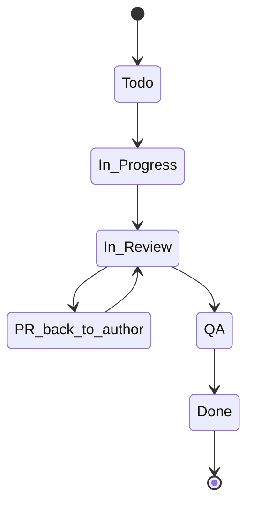

# Use Github

<!-- toc -->

- [Introduction](#introduction)
- [Concepts](#concepts)
  * [Sprints](#sprints)
  * [Projects](#projects)
  * [Issue](#issue)
  * [Label](#label)
    + [List of labels](#list-of-labels)
  * [Status](#status)
  * [PR](#pr)
- [Issue workflows](#issue-workflows)
  * [Naming an Issue](#naming-an-issue)
  * [Filing a new issue](#filing-a-new-issue)
  * [Updating an issue](#updating-an-issue)
  * [Closing an issue](#closing-an-issue)
- [PR workflows](#pr-workflows)
  * [PR labels](#pr-labels)
  * [Filing a new PR](#filing-a-new-pr)
    + [General tips](#general-tips)
    + [Filing process](#filing-process)
  * [Review](#review)
  * [Addressing a comment](#addressing-a-comment)
  * [Coverage reports in PRs - discussion](#coverage-reports-in-prs---discussion)

<!-- tocstop -->

## Introduction

- In the following we use the abbreviations below:
  - GH = GitHub
  - PR = Pull Request
  - RP = Responsible party (aka Team Leader)
- Everything we work on comes in the form of a GH Issues
  - We call GH Issues "issues", and "tasks", (sometimes "tickets")
    interchangeably
  - We avoid to call them bugs since many times we use GH to track ideas,
    activities, and improvements, and not only defects in the code
  - We file tasks, prioritize them, and distribute the workload across the team
  - We try to always work on high priority (aka, P0) tasks

## Concepts

### Sprints

- Sprints are weekly, Monday - Friday and consist of the Issues worked on during
  the week
- Sprints help us answer the questions
  - What work should the team be focusing during this week?
  - What did the team achieve last week?
- Anything worked on during a week is added to that week's Sprint
- Issues added to a Sprint but not worked on or completed during the week should
  not be removed (Issues can belong to more than one Sprint, and not removing
  helps measure how "overloaded" a Sprint was)
- Each week's Sprint has Issues added to it by Team Leaders before Monday's work
  begins
- Every Issue in a Sprint should be linked to a GH project
- To support adaptability and flexibility, Issues may be added to a Sprint
  mid-week (but Issues should not be removed). While this may require
  sacrificing other Issues in the Sprint, the point is to make the trade-off
  apparent

### Projects

- GitHub Projects are thematic groups of Issues that are somehow related by
  their topic
  - It may take multiple Sprints to complete all the Issues in an Project
  - Most Projects are created around software components or user workflows
    (which may cross software components)
- For more information on GH Projects, see
  [ck.github_projects_process.reference.md](/docs/work_organization/ck.github_projects_process.reference.md)

### Issue

- Each Issue is a piece of work to be done
- Issues are combined into Projects by topic
- An Issue has certain characteristics, i.e. labels
- An Issue has a progress status, (e.g., `Todo`, `In progress`, `Done`)
- PRs are linked to work needed to complete an Issue
- An issue might not have an assignee but before execution of course it needs to
  be resolved
- An issue may be labeled as "Epic" if it has associated sub-issues.
  - However, this is not a standard in our workflow.
- See also
  [ck.issue_workflow.explanation.md](/docs/work_organization/ck.issue_workflow.explanation.md)
  for the description of the concept of Issues as opposed to Ideas/Projects.

### Label

- Labels are attributes of an issue (or PR), e.g., `good first issue`,
  `PR_for_reviewers`, `duplicate`, etc.
- See the current list of labels and their descriptions are
  [Kaizenflow](https://github.com/causify-ai/kaizenflow/labels) and
  [cmamp](https://github.com/causify-ai/cmamp/labels)
  - The repos should always have labels in sync

#### List of labels

- `Blocking`: This issue needs to be worked on immediately
- `Bug`: Something isn't working
- `Cleanup`
- `Design`
- `Documentation`: Improvements or additions to documentation
- `Enhancement`: New feature or request
- `Epic`: A high-level issue, possibly encompassing sub-issues
- `good first issue`: Good for newcomers
  > TODO(gp): `Good_first_issue`
- `Outsource`: Anybody can do it
- `P0`: Issue with a high priority
- `P1`: Issue is important but has less priority
- `P2`: Issue which is not urgent and has the lowest priority
- `Paused`: An issue was started and then stopped
- `PR_for_authors`: The PR needs authors to make changes
- `PR_for_reviewers`: The PR needs to be reviewed by team leaders
  > TODO(gp): -> `PR_for_team_leaders`
- `PR_for_integrators`: The PR needs to be reviewed by Integrators and possibly
  merged
- `Readings`: Reading a book, article and getting familiar with code
- `To close`: An issue can be potentially closed
  > TODO(gp): -> To_close

### Status

- Each Issue in a Project is assigned a progress status
- We have the following status options:
  - `Todo`
    - Issues that are new, where the work has not started yet
    - `assignee` should be the tech lead of that area
  - `In Progress`
    - Issues that we are currently being worked on
  - `In Review`
    - Issues opened for review and testing
    - Code is ready to be merged pending feedback
  - `PR back to author`
    - Feedback has been given on a PR, awaiting updates from the author
  - `QA`
  - `Done`
    - Issues that are done and are waiting for closing
    - Integrators / team leaders are responsible for closing



### PR

- A pull request (PR) is an event where a contributor asks to review code they
  want to merge into a project

## Issue workflows

### Naming an Issue

- Use an informative description, typically in the form an action
  - E.g., "Do this and that"
- We don't use a period at the end of the title
- We prefer to avoid too much capitalization to make the Issue title easy to
  read and for consistency with the rest of the bugs

  **Good**
  ```
  Optimize Prometheus configuration for enhanced Kubernetes monitoring
  ```

  **Bad**
  ```
  Optimize Prometheus Configuration for Enhanced Kubernetes Monitoring
  ```

- They are equivalent, but the first one is more readable

### Filing a new issue

- If it is a "serious" problem (bug) put as much information about the Issue as
  possible, e.g.,:
  - What you are trying to achieve
  - Command line you ran, e.g.,
    ```
    > i lint -f defi/tulip/test/test_dao_cross_sol.py
    ```
  - **Copy-paste** the error and the stack trace from the command line, no
    screenshots, e.g.,
    ```
    Traceback (most recent call last):
      File "/venv/bin/invoke", line 8, in <module>
        sys.exit(program.run())
      File "/venv/lib/python3.8/site-packages/invoke/program.py", line 373, in run
        self.parse_collection()
    ValueError: One and only one set-up config should be true:
    ```
  - The log of the run
    - Maybe the same run using `-v DEBUG` to get more info on the problem
  - What the problem is
  - Why the outcome is different from what you expected
- Use check boxes for "small" actions that need to be tracked in the Issue (not
  worth their own Issue)
  - An issue should be closed only after all the checkboxes have been addressed
    OR the remaining checkboxes were either transformed into new issues in their
    own right (e.g. if the implementation turned out to be more complex than
    initially thought) OR have a reason for not being implemented
  - These things should be mentioned explicitly before closing the issue
    (Element of Least Surprise.).
- We use the `FYI @...` syntax to add "watchers"
  - E.g., `FYI @cryptomtc` so that he receives notifications for this issue
  - Authors and assignees receive all the emails in any case
  - In general everybody should be subscribed to receiving all the notifications
    and you can quickly go through them to know what's happening around you
- Assign an Issue to the right person for re-routing
  - There should be a single assignee to a Issue so we know who needs to do the
    work
  - Assign Integrators / Team leaders if not sure
- If you are not sure, leave it unassigned but `@tag` Integrators / team leaders
  to make sure we can take care of it
- Assign an Issue to the right Project and Label
  - Use `Blocking` label when an issue needs to be handled immediately, i.e. it
    prevents you from making progress
  - If you are unsure then you can leave it empty, but `@tag` Integrator / team
    leaders to make sure we can re-route and improve the Projects/Labels

### Updating an issue

- For large or complex Issues, there should be a design phase (in the form of GH
  Issue, Google Doc, or design PR) before starting to write a code
  - A team leader / integrator should review the design
- When you start working on an Issue, change its status to `In Progress`
  - Try to use `In Progress` only for Issues you are actively working on
  - A rule of thumb is that you should not have more than 2-3 `In Progress`
    Issues
  - Give priority to Issues that are close to being completed, rather than
    starting a new Issue
- Update an Issue on GH often, like at least once a day of work
  - Show the progress to the team with quick updates
  - Update your Issue with pointers to gdocs, PRs, notebooks
  - If you have questions, post them on the bug and tag people
- Once the task, in your opinion, is done, change the status to `To Review` so
  that Integrator / team leaders can review it
- If we decide to stop the work, add a `Paused` label

### Closing an issue

- A task is closed when PR has been reviewed and merged into `master`
- When, in your opinion, there is no more work to be done on your side on an
  Issue, change its status to `Done` but do not close it
  - Integrators / team leaders will close it after review
- If you made specific assumptions, or if there are loose ends, etc., add a
  `TODO(user)` or file a follow-up Issue
- Done means that something is "DONE", not "99% done"
  - "DONE" means that the code is tested, readable, and usable by other
    teammates
- Together we can decide that 99% done is good enough, but it should be a
  conscious decision and not comes as a surprise
- There should be a reason when closing an issue
  - E.g. - closing as PR is merged
  - E.g. - closing since obsolete

## PR workflows

### PR labels

- `PR_for_authors`
  - There are changes to be addressed by an author of a PR
- `PR_for_reviewers`
  - PR is ready for review by team leaders
- `PR_for_integrators`
  - PR is ready for the final round of review by Integrators, i.e. close to
    merge

### Filing a new PR

#### General tips

- Implement a feature in a branch (not `master`), once it is ready for review
  push it and file a PR via GH interface
- We have `invoke` tasks to automate some of these tasks:
  ```
  > i git_branch_create -i 828
  > i git_branch_create -b Cmamp723_hello_world
  > i gh_create_pr
  ```
- If you want to make sure you are going in a right direction or just to confirm
  the interfaces you can also file a PR to discuss
- Mark PR as draft if it is not ready, use the `convert to draft` button
  - Draft PR should be filed when there is something to discuss with and
    demonstrate to the reviewer, but the feature is not completely implemented

    

#### Filing process

- Add a description to help reviewers to understand what it is about and what
  you want the focus to be
  - Add a pointer in the description to the issue that PR is related to - this
    will ease the GH navigation for you and reviewers
- Leave the assignee field empty
  - This will be done by team leaders
- Add reviewers to the reviewers list
  - For optional review just do `@FYI` `person_name` in the description
- Add a corresponding label
  - Usually the first label in the filed PR is `PR_for_reviewers`
  - If it is urgent/blocking, use the `Blocking` label
- Make sure that the corresponding tests pass
- Always lint before asking for a review
- If the output is a notebook:
  - Publish a notebook, see
    [here](/docs/work_tools/all.development.how_to_guide.md#publish-notebooks)
  - Attach a command line to open a published notebook, see
    [here](/docs/work_tools/all.development.how_to_guide.md#open-a-published-notebook)

### Review

- A reviewer should check the code:
  - Architecture
  - Conformity with specs
  - Code style conventions
  - Interfaces
  - Mistakes
  - Readability
- There are 2 possible outcomes of a review:
  - There are changes to be addressed by author
    - A reviewer leaves comments to the code
    - Marks PR as `PR_for_authors`
  - A PR is ready to be merged:
    - Pass it to integrators and mark it as `PR_for_integrators`
      - Usually is placed by team leaders after they approve PR

### Addressing a comment

- If the reviewer's comment is clear to the author and agreed upon:
  - The author addresses the comment with a code change and after changing the
    code (everywhere the comment applies) marks it as `RESOLVED` on the GH
    interface
  - Here we trust the authors to do a good job and to not skip / lose comments
  - If the comment needs further discussion, the author adds a note explaining
    why he/she disagrees and the discussion continues until consensus is reached
- Once all comments are addressed:
  - Re-request the review
  - Mark it as `PR_for_reviewers`

### Coverage reports in PRs - discussion

- We should start posting coverage reports in PRs.

- The suggested process is:
  - PR's author posts coverage stats before (from master) and after the changes
    in the format below. The report should contain only the files that were
    touched in a PR.
    - We have `run_coverage_report` invoke
      - `TODO(*): Enable for Sorrentum and add usage examples.`
    - Maybe we can automate it somehow, e.g., with GH actions. But we need to
      start from something.
      ```
      Name                                    Stmts   Miss Branch BrPart  Cover
      -------------------------------------------------------------------------
      oms/locates.py                              7      7      2      0     0%
      oms/oms_utils.py                           34     34      6      0     0%
      oms/tasks.py                                3      3      0      0     0%
      oms/oms_lib_tasks.py                       64     39      2      0    38%
      oms/order.py                              101     30     22      0    64%
      oms/test/oms_db_helper.py                  29     11      2      0    65%
      oms/api.py                                154     47     36      2    70%
      oms/broker.py                             200     31     50      9    81%
      oms/pnl_simulator.py                      326     42     68      8    83%
      oms/place_orders.py                       121      8     18      6    90%
      oms/portfolio.py                          309     21     22      0    92%
      oms/oms_db.py                              47      0     10      3    95%
      oms/broker_example.py                      23      0      4      1    96%
      oms/mr_market.py                           55      1     10      1    97%
      oms/__init__.py                             0      0      0      0   100%
      oms/call_optimizer.py                      31      0      0      0   100%
      oms/devops/__init__.py                      0      0      0      0   100%
      oms/devops/docker_scripts/__init__.py       0      0      0      0   100%
      oms/order_example.py                       26      0      0      0   100%
      oms/portfolio_example.py                   32      0      0      0   100%
      -------------------------------------------------------------------------
      TOTAL                                    1562    274    252     30    80%
      ```
- PR's author also sends a link to S3 with the full html report so that a
  reviewer can check that the new lines added are covered by the tests
