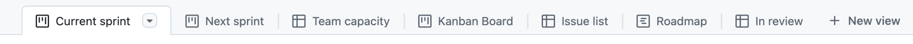

<!-- toc -->

- [GitHub Projects process](#github-projects-process)
  * [Overview](#overview)
  * [GH project structure](#gh-project-structure)
    + [Issue fields](#issue-fields)
    + [How to set up a new project](#how-to-set-up-a-new-project)
    + [Special types of project](#special-types-of-project)
  * [Sprint process](#sprint-process)
  * [Automation](#automation)
    + [Built-in workflows](#built-in-workflows)
    + [Github Actions automations](#github-actions-automations)
  * [Parent and sub-issues](#parent-and-sub-issues)

<!-- tocstop -->

# GitHub Projects process

## Overview

- We use GitHub projects to track progress on individual
  components/products/services

- The entrypoint to preview available projects is
  [<u>https://github.com/orgs/cryptokaizen/projects</u>](https://github.com/orgs/cryptokaizen/projects) -
  TODO(Juraj): this link will work only for people who are directly members of
  the organization (not collaborators)

## GH project structure

- A GH project represents a long-term project that is composed of GH Issues,
  executed by multiple team members according to Sprints

- Each GH project window consists of tabs called "views"

- A view can provide a specific perspective on the issues in the project, e.g.,
  filter certain issues by their attributes, visualize them in a board/list



- We use a base
  [<u>template</u>](https://github.com/cryptokaizen/cmamp/projects?query=is%3Aopen+is%3Atemplate)
  for all of our projects to ensure consistency between projects

- The base template consists of the following views:
  - Current sprint - provides a kanban board of issues in the currently running
    sprint
  - Next sprint - provides a kanban board of issues in the next sprint
  - Backlog - list of a non-finished issues in a given project without a sprint
    assigned
  - Team capacity - aggregates "estimate point" for each collaborator in the
    project
  - Issue list - a "warehouse" to preview all of the project issues regardless
    of its status

### Issue fields

- Each issue within a project contains specific fields:
  - **Status** (TODO, In Progress, Done)
    - What phase of the development the issue is in
  - **Estimate** in terms of "uninterrupted hours of work"
    - What is the issues' estimated implementation difficulty
    - We want to become good at estimating complexity and overcome being
      uncomfortable in providing ETAs
    - Estimating complexity in terms of hours of work is done to the best of our
      ability acknowledging that higher priority issues come up, we get
      interrupted sometimes, debugging or implementing a feature might take more
      time than expected
    - We are ok with doing our best to estimate and we are ok failing to meet
      our expectations, so that we can learn and improve
  - **Sprint**
    - Which weekly sprint this issue belongs to

- It's possible to add new fields; the list above includes the agreed upon
  fields shared across all projects

### How to set up a new project

- Click on `Projects` tab in the desired repository, e.g.
  [<u>https://github.com/cryptokaizen/cmamp</u>](https://github.com/cryptokaizen/cmamp)

- Click on the green `New Project` button

- A new window with a pop-up should appear, in the pop-up choose
  `Project templates` > `From your organization` and choose **[TEMPLATE] Kaizen
  Project**

- Change the default name `@yourusername untitled project` to a relevant name
  - The name should be short and representative of what needs to be done
  - Ideally we want to complete a Project in 2-3 months, since we don't want to
    have long-running projects linger forever on the board. Each project should
    have a clear goal
  - Long-running projects should be broken in smaller projects to show and
    measure progress
  - If a project can't be easily described in a phrase starting with a verb, it
    means that the scope is too big
  - Good names are:
    - "CustomerXYZ Proof-of-concept", e.g., "ITSavvy Proof-of-concept"
    - "Split cmamp into separate repos"
    - "FAR trading"
    - "Implement v0.1 of XYZ", "Deploy XYZ", ...
  - Bad names are:
    - "Config". A better name is "Make config robust" or "Config - Q1-2024
      Goals"

- Click on the `Project details` button in the upper right corner next to the
  three dots `...`
  - Provide a short description of the project, e.g.,who is the customer
  - What is the overarching goal of the project
  - Who is the team leader
  - Provide links to the key resources (Slack/Asana channel)

- Add team members to the project
  - Click on the three dots `...` (View more button) and go to
    `Settings > Manage access > Invite collaborators`
  - Set write access if you want a team member to be able to add new issues to
    the project and manage the state of the issues

- Open Slack and create a channel for the project
  - The naming convention is `proj-<<project-name>>`
  - The Slack channel is used to communicate with the team working on that
    project, using our conventions of what's so urgent to require an IM
  - Click on `Add Canvas` and create a `Channel Overview` canvas
    - Provide a short description (can be the same as in GitHub project)
    - Include links to the GitHub and Asana

- Open Asana and create a new project
  - The naming convention is `Proj - <<project name>>`
  - The Asana project is used to
    - Track non-technical issues (i.e., track work that doesn't easily map in
      terms of coding)
    - To track the project at higher level than GH
  - The Asana board is typically used by the project Team leader to communicate
    status to the other departments and Team leaders
  - E.g., on Asana we can do high level planning and track work that is not
    ready yet to be filed as GH Issues, similar to what we do with Google Docs

- In general there is not a clear cut distinction between what goes in GH
  Project, GH Issues, Asana tasks, Google Docs planning
  - We agree that a GH Project includes many GH Issues
  - We agree that things can go in GH Project or in Asana tasks or in a Google
    Doc planning docs
  - We let people a bit of flexibility to do things however they are more
    comfortable
  - E.g., GP likes Google Docs to sketch out a project and track issues, Asana
    to track at high-level, and one Issue per "feature" when the Issue is ready
    to be executed

### Special types of project

- Not all project need to have an explicit start and finish date

- Each team (Infra/Devops, DataPull, ML ops etc.) should have their catch-all
  project to track the issues

## Sprint process

1.  Sprints run on Sunday to Saturday schedule
    - This is due to the fact that Friday is the preferred day to complete
      status updates
    - GitHub issue `sprint` field adheres to this convention

2.  Project owner creates a GitHub status update (by clicking on the Status
    button on the upper right in a given project) until 11 AM ET each Friday

    1.  The 11 AM deadline was chosen to facilitate easier completion of Asana
        status updates which have a 12 AM deadline
        - In practice the GitHub project status updates will often serve as the
          source of information for the Asana update

    2.  The status update should include the following sections:
        - Summary (what was accomplished, what kind of obstacles did the team
          run into)
        - Next steps (explain work for the next 1-2 sprints)
        - Example update:
```
Summary

- We have finished updating ETL pipeline for historical bid/ask data
    for additional symbols (the work started two sprints ago)

- We have started to run daily scheduled live trading runs (low
    volume, short runs) using one of our off-the-shelf models
    - This is a major step forward for the team as it involved
        collaboration between all engineering departments
    - The runs were completed successfully from start to finish for
        the last couple of days

- The orderbook related ETL and backtest pipelines encountered some
    unexpected obstacles (code-base related). It took a bit more time
    than expected to resolve them, but it didn't take us off track.

Next steps

- Increase the length of daily low-volume trading to exercise the
    whole system from start to finish in a more rigorous manner and
    catch some corner-case behavior (mainly with regards interaction
    with exchange API)

- Run back-test(s) for orderbook-based model(s).

- Kick-off work on a new crypto.com specific model
```

- The status update is sent to customers (either external or internal sending to
  all@)

- Project owner (or a TL) can ask other collaborators in the project to also add
  status updates if needed, before broadcasting, to make sure we manage
  expectations.

## Automation

### Built-in workflows

- GitHub offers a handful of
  [<u>built-in workflows</u>](https://docs.github.com/en/issues/planning-and-tracking-with-projects/automating-your-project/using-the-built-in-automations)
  to automate frequently run actions within projects
  - For example: when an issue is closed, set the status to done

- To open the workflows menu, click on the `...` button in the upper right
  corner of the project view and select "Workflows"

- In our
  [<u>base template</u>](https://github.com/cryptokaizen/cmamp/projects?query=is%3Aopen+is%3Atemplate)
  we currently use
  [<u>these</u>](https://github.com/orgs/cryptokaizen/projects/18/workflows)
  automated workflows

### Github Actions automations

- For more customized automated workflows we use GitHub actions

- A GitHub Action
  [`sprint_iteration.yml`](https://github.com/causify-ai/cmamp/blob/master/.github/workflows/sprint_iteration.yml) is set up to
  move items in active projects from last sprint to current sprint at the
  beginning of each sprint.

## Parent and sub-issues

- GitHub offers
  [<u>sub-issues</u>](https://docs.github.com/en/issues/tracking-your-work-with-issues/using-issues/adding-sub-issues)
  to breakdown complex or higher-level task into smaller chunks of works

- Our current convention is _not_ to use this feature
