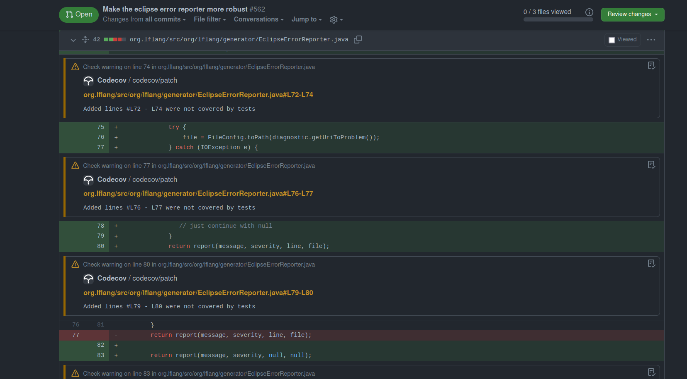
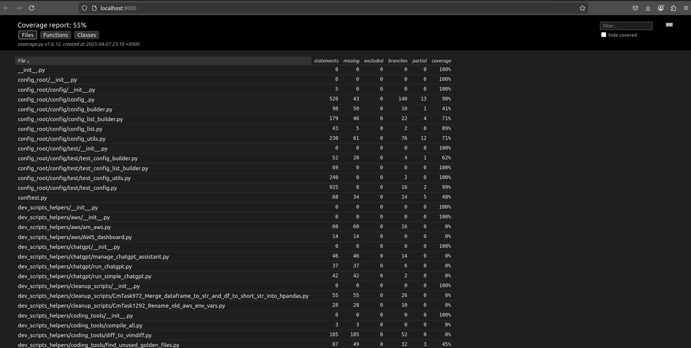
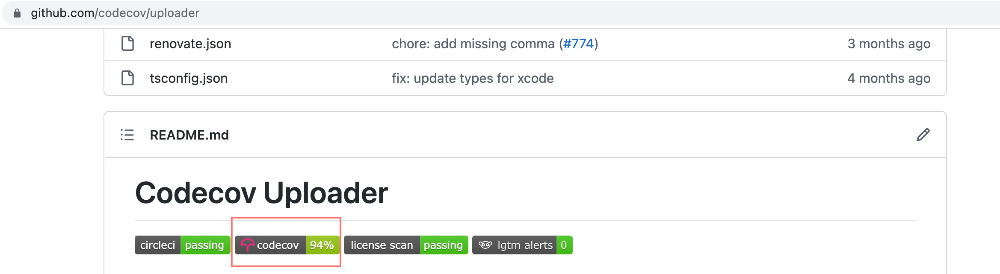

<!-- toc -->

- [Codecov Integration and Coverage Setup Documentation](#codecov-integration-and-coverage-setup-documentation)
  * [Setting Up Codecov](#setting-up-codecov)
  * [Coverage Configuration](#coverage-configuration)
  * [GitHub Actions Workflow](#github-actions-workflow)
    + [Workflow Schedule](#workflow-schedule)
    + [Workflow Jobs](#workflow-jobs)
  * [Codecov Configuration](#codecov-configuration)
  * [Viewing Coverage Reports](#viewing-coverage-reports)
  * [Running Coverage Locally](#running-coverage-locally)
  * [System Behavior: When the Test Coverage Workflow Fails or Continues](#system-behavior-when-the-test-coverage-workflow-fails-or-continues)
  * [Additional Functionalities and Extensions](#additional-functionalities-and-extensions)
  * [Coverage Behavior and Best Practices](#coverage-behavior-and-best-practices)
  * [Troubleshooting](#troubleshooting)

<!-- tocstop -->

# Codecov Integration and Coverage Setup Documentation

This documentation describes the setup and usage of Codecov integration for our
repos. The purpose is to explain how Codecov coverage tracking is configured,
the functionalities implemented, and how developers can interpret, interact
with, and extend the coverage results.

## Setting Up Codecov

Codecov was integrated by adding necessary files and configuration steps:

Files and Directories Added

- [.coveragerc](/.coveragerc): Configures directories and files under coverage
  collection
- [/.github/gh_requirements.txt](/.github/gh_requirements.txt): Lists
  dependencies necessary for the coverage workflow
- [/.github/workflows/coverage_tests.yml](/.github/workflows/coverage_tests.yml):
  Defines GitHub Actions workflow for automated coverage runs

External setup

Applies default coverage settings across all repos to ensure consistency in
reporting and behavior. If needed, individual repos can include their own
`.codecov.yml` at the root to override specific global settings.

- [Global YAML](https://app.codecov.io/account/gh/causify-ai/yaml/.): Configures
  coverage collection of Codecov

## Coverage Configuration

The `.coveragerc` file defines coverage measurement settings:

- `Excluded Files`: These files are omitted from coverage reporting.
  ```ini
  [report]
  omit =
      */devops/compose/*
      */helpers/test/outcomes/*/tmp.scratch/*
  ```

## GitHub Actions Workflow

Coverage tests are automated via GitHub Actions -
`.github/workflows/coverage_tests.yml`.

### Workflow Schedule

- Runs daily at midnight (UTC)
- Can be manually triggered (`workflow_dispatch`)
- Action fails if coverage drops by `1%` (including `fast`, `slow` and
  `superslow` tests)

### Workflow Jobs

1. Fast Tests Coverage:

- Runs daily or on manual trigger
- Uploads report flagged as `fast`

2. Slow Tests Coverage:

- Runs daily or on manual trigger
- Uploads report flagged as `slow`

3. Superslow Tests Coverage:

- Runs weekly on Monday or on manual trigger.
- Uploads report flagged as `superslow`.

4. Each job:

- Generates an `XML` coverage report (`Global YAML`)
- Uploads reports to `Codecov` with respective flags (`fast`, `slow`,
  `superslow`)

## Codecov Configuration

- Coverage flags and project-level checks are configured at Global yml -
  [https://app.codecov.io/account/gh/causify-ai/yaml/.](https://app.codecov.io/account/gh/causify-ai/yaml/.)
- If required, you can add distinct repository configurations to the
  `.codecov.yml` file at the root of your repository. - You can change the
  threshold of coverage drops for a specific repo - You can add/ change patch
  settings or flags for a specific repo

1. Flag Management

   The `carryforward` option allows Codecov to reuse the previous coverage data
   if a report is not submitted for a given flag in the current CI run. This is
   useful when certain test suites (e.g., slow or superslow) don't run in every
   cycle but should still be reflected in the coverage summary.

   ```yml
   flag_management:
   individual_flags:
     - name: fast
       carryforward: true
     - name: slow
       carryforward: true
     - name: superslow
       carryforward: true
   ```

2. Comment Behavior

   Codecov can automatically post a summary comment on PRs. This comment can be
   customized in layout, behavior, and verbosity.
   - `layout: "reach, diff, files"` : Displays overall coverage, diff coverage,
     and file-level detail
   - `behavior: default` : Overwrites the previous comment instead of posting a
     new one
   - `require_changes: false` : Posts the comment even when coverage doesn't
     change
   - `show_critical_paths: false` : Disables per-line comments in the PR diff
     view

   ```yml
   comment:
     layout: "reach, diff, files"
     behavior: default
     require_changes: false
     show_critical_paths: false
   ```
   - When PR comment is enabled:

     
   - When per-line comments in PR files is enabled:

     

3. GitHub Check Annotations

   Inline annotations in the GitHub `Files changed` view are disabled using the
   `github_checks.annotations` flag. This ensures a cleaner PR experience
   without coverage-based highlights on each line.

     

4. Coverage Status Check:

   This section configures the status checks that appear in GitHub pull
   requests. It defines both patch-level and project-level coverage checks and
   sets conditions for when they should run and how they should behave.
   - `project.default`: Defines the overall coverage check behavior.
   - `target`: auto automatically compares against the base branch of the PR.
   - `threshold: 1%` means the check will fail if coverage drops by `1%` or
     more.
   - `flags` scopes the project-level check to specific test suites (`fast`,
     `slow`, `superslow`).
   - `branches` limits the check to PRs targeting the `master` branch.
   - `patch: true`: Ensures Codecov always checks coverage on the changed lines
     in a PR, regardless of the base branch or flag.

   ```yml
   coverage:
     status:
       project:
         default:
           target: auto
           threshold: 1%
           flags:
             - fast
             - slow
             - superslow
           branches:
             - master
       patch: true
   ```

     

## Viewing Coverage Reports

Coverage results for the helpers repository are accessible via Codecov.

- Codecov UI link for helpers -
  [https://app.codecov.io/gh/causify-ai/helpers](https://app.codecov.io/gh/causify-ai/helpers)
- Master Build Dashboard Notebook:
  [http://172.30.2.44/build/buildmeister_dashboard/Master_buildmeister_dashboard.latest.html#Code-coverage-HTML-page](http://172.30.2.44/build/buildmeister_dashboard/Master_buildmeister_dashboard.latest.html#Code-coverage-HTML-page)

## Running Coverage Locally

Developers can manually run coverage tasks locally via Invoke commands and
generate html report:

- Fast Tests:

  ```yml
  invoke run_coverage --suite fast --generate-html-report
  ```

- Slow Tests:

  ```yml
  invoke run_coverage --suite slow --generate-html-report
  ```

- Superslow Tests:

  ```yml
  invoke run_coverage --suite superslow --generate-html-report
  ```

- Review HTML coverage report
  - Run a local HTTP server to serve the HTML:
    ```bash
      cd htmlcov
      python3 -m http.server 8000
    ```
  - If you're running this on a remote server, set up SSH port forwarding:
    ```bash
      ssh -i ~/.ssh/<private_key> -L 8000:localhost:8000 <user_name>@<server_ip>
    ```
  - Then open your browser and go to:
    [http://localhost:8000](http://localhost:8000)

    

## System Behavior: When the Test Coverage Workflow Fails or Continues

This section documents how the Test coverage workflow behaves under various
failure conditions, specifically regarding the fast, slow, and superslow test
suites.

1. Dependency / Setup Steps

Steps included:

- AWS credential configuration
- Docker login
- Cleanup
- Code checkout
- PYTHONPATH update
- Dependency installation

Behavior:

- If any of these steps fail, the workflow fails immediately
- No test suites (fast, slow, superslow) will run
- This is intentional to prevent test execution in a broken or incomplete
  environment

2. Fast / Slow Test Steps

Steps included:

- `run_fast`
- `upload_fast`
- `run_slow`
- `upload_slow`

These steps use `continue-on-error: true`.

Behavior:

- If any of these steps fail, the workflow continues without immediate failure
- The superslow test will still run if the workflow is triggered on Monday
  (scheduled) or manually (workflow_dispatch)
- However, the workflow may still fail at the end if fast/slow failures are
  detected by the final failure check step

3. Superslow Test Steps

Steps included:

- `run_superslow`
- `upload_superslow`

These steps do not use `continue-on-error`.

Behavior:

- These steps run only:
  - On scheduled workflows that fall on a Monday (DAY_OF_WEEK == 1)
  - Or when the workflow is manually triggered
- If either step fails, the workflow fails immediately
- If both pass, the workflow continues to the final fast/slow check

4. Final Failure Check (Fast/Slow Only)

Step included:

- Fail if fast/slow test or upload failed

Behavior:

- This step runs at the very end of the workflow
- It checks whether any of the fast/slow test or upload steps failed
- If any of them failed, this step causes the entire job to fail using exit 1
- This ensures that silent failures in fast/slow coverage are surfaced, even if
  superslow passes

| Step Type        | Step Failed?              | Superslow Runs?         | Job Fails?              |
| ---------------- | ------------------------- | ----------------------- | ----------------------- |
| Setup Step       | Yes                       | No                      | Yes                     |
| Fast Test        | Yes                       | Yes (Mon/dispatch only) | Yes (after final check) |
| Slow Test        | Yes                       | Yes (Mon/dispatch only) | Yes (after final check) |
| Superslow Test   | Yes                       | n/a                     | Yes                     |
| Final Fail Check | Yes (if fast/slow failed) | Already ran             | Yes                     |

## Additional Functionalities and Extensions

Additional functionalities provided by Codecov that can be utilized or extended
include:

- `Pull Request Comments`: Automatically generate detailed coverage summaries or
  line-by-line coverage comments directly in GitHub pull requests
- `Coverage Badges`: Integrate coverage badges in the repository `README` to
  visibly show current coverage status

  

- `Report Customization`: Configure detailed reporting settings to specify what
  information to display or omit in coverage summaries

## Coverage Behavior and Best Practices

- Coverage reports are uploaded regardless of test success to ensure coverage
  tracking consistency
- Coverage flags (`fast`, `slow`, `superslow`) allow separate visibility and
  tracking
  - Fast test coverage:

  

- Regular review of coverage differences (visible in PR checks and Codecov UI)
  is encouraged to maintain code quality

## Troubleshooting

- Check GitHub Actions logs for errors in coverage upload steps
- Ensure `CODECOV_TOKEN` is correctly set as a GitHub secret
- Validate workflow and coverage configuration files for correctness if issues
  arise
