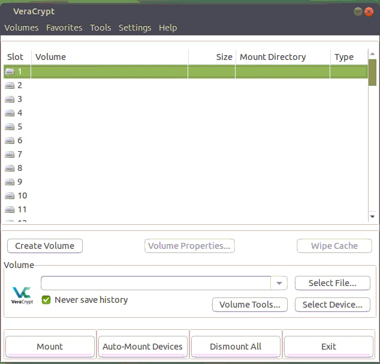
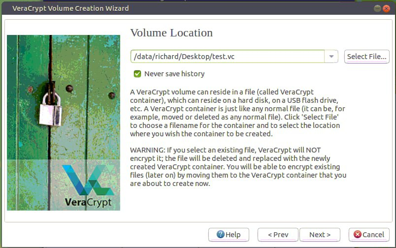
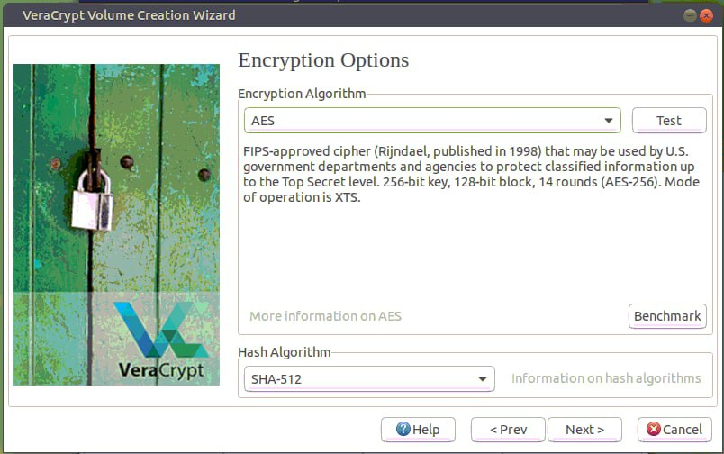
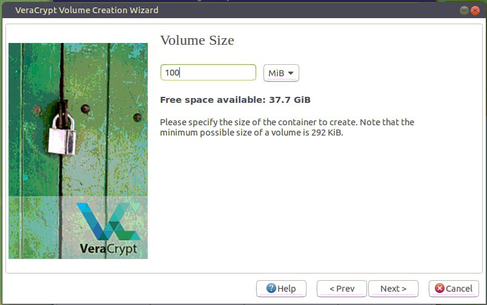
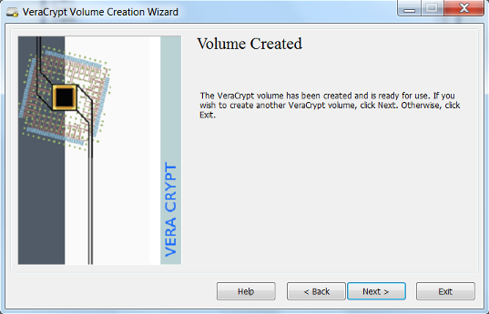
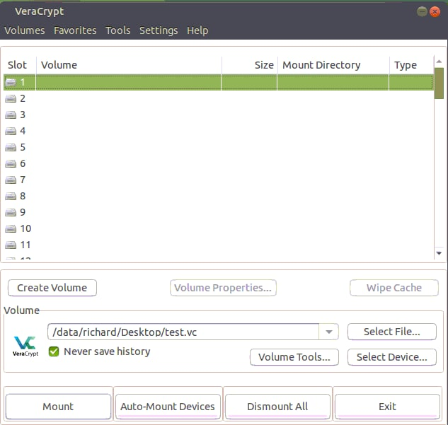

# How to use VeraCrypt

<!-- toc -->

- [Using GUI](#using-gui)
  * [Creating a VeraCrypt Volume](#creating-a-veracrypt-volume)
  * [Mounting a VeraCrypt Volume](#mounting-a-veracrypt-volume)
  * [Unmounting a VeraCrypt Volume](#unmounting-a-veracrypt-volume)
- [Using CLI](#using-cli)
  * [Creating a VeraCrypt volume with interactive mode](#creating-a-veracrypt-volume-with-interactive-mode)
  * [Create a VeraCrypt volume with non-interactive mode](#create-a-veracrypt-volume-with-non-interactive-mode)
  * [Mounting a VeraCrypt Volume](#mounting-a-veracrypt-volume-1)
- [Unmounting a VeraCrypt Volume](#unmounting-a-veracrypt-volume-1)
- [How to use a Git client under an encrypted volume](#how-to-use-a-git-client-under-an-encrypted-volume)
  * [Mount](#mount)
  * [One time set-up](#one-time-set-up)
  * [Create the tmux env](#create-the-tmux-env)

<!-- tocstop -->

## Using GUI

1.  Connect to VPN

2.  Connect to one of dev server via **VNC** that you want to have or already
    have encrypted folder

3.  In CLI, type veracrypt or via application menu open veracrypt

### Creating a VeraCrypt Volume

1. Open up the VeraCrypt application and select "Create Volume".
2. Select "Create an encrypted file container" and click "Next".

3. Then choose if you want hidden or standard volume

4. Create a name and select a location to save the VeraCrypt volume that you
   will be creating and select "Next."
   - It is helpful if you create a volume name that ends with `.vc`. This will
     associate the volume with the VeraCrypt application.



5.  VeraCrypt provides some options for encryption. Select the desired
    encryption algorithms and select "Next". VeraCrypt uses the AES algorithm by
    default and is recommended for selection.
    - In most cases a 500mb size volume is suitable. However this depends on the
      user's need and should be adjusted accordingly.



6. Create the size of the volume that you would like to create. Click "Next".
   - Set the volume to have appropriate size.



7. Create a password for your encrypted volume. Click "Next".
   - The longer the password the better it is. It is important to not lose your
     password. A lost password will make the data unrecoverable.


8. Select the file system and click "Next". The default is suitable in most
   cases. Then you should move your mouse to get randomness in Pool but feel
   free to click "Format".
   - You do not need to move your cursor that much as this server is behind VPN.

 

9. Your volume has been created. Click "Exit" or X button in top right corner.



### Mounting a VeraCrypt Volume

1. Select the VeraCrypt volume that you would like to mount. Select the letter
   drive location you would like to use. Click "Mount".



2. Enter your password for the VeraCrypt volume. Click "OK".


3. The drive is now unencrypted and ready for use at the Mount Directory
   (`/media/veracrypt<slotnumber>`). Save files and documents as you would
   normally do with a mounted drive.


### Unmounting a VeraCrypt Volume


- You can Encrypt files by Dismounting Volume, Select Slot and press Dismount

## Using CLI

### Creating a VeraCrypt volume with interactive mode

- If you need help use `veracrypt -h` there is everything you need

- If it asks this: (Enter your user password or administrator password:) use
  your os_password or type sudo before the command.

- Be careful in not deleting the file that VeraCrypt uses to store the data
  (e.g., `/data/saggese/.src_vc_DO_NOT_OVERWRITE`)

- Go to the server in your home and create a Veracrypt dir under your `$HOME`.
  Since the directory typically stores code, we assume that it's in parallel to
  `$HOME` like `/data/saggese/src_vc_encrypted`

```bash
> sudo veracrypt -t -c
Volume type:
1) Normal
2) Hidden
Select [1]: 1

Enter volume path: /data/$USER/.src_vc_DO_NOT_OVERWRITE

# An orange client is around 350M, so you can create 2GB worth of encrypted dir

Enter volume size (sizeK/size[M]/sizeG): 2G

Encryption Algorithm:
1) AES
2) Serpent
3) Twofish
4) Camellia
5) Kuznyechik
6) AES(Twofish)
7) AES(Twofish(Serpent))
8) Camellia(Kuznyechik)
9) Camellia(Serpent)
10) Kuznyechik(AES)
11) Kuznyechik(Serpent(Camellia))
12) Kuznyechik(Twofish)
13) Serpent(AES)
14) Serpent(Twofish(AES))
15) Twofish(Serpent)
Select [1]: 1

Hash algorithm:
1) SHA-512
2) Whirlpool
3) SHA-256
4) Streebog
Select [1]: 1

Filesystem:
1) None
2) FAT
3) Linux Ext2
4) Linux Ext3
5) Linux Ext4
6) NTFS
7) exFAT
8) Btrfs
Select [2]: 5

# Avoid using "FAT" as it does not support symbolic links, meaning that
# files such as `invoke.yaml`, `conftest.py` (hence `i docker_bash`,
# `i run_fast_tests`) won't work, because in `lemonade` they are symbolic
# links to the corresponding files in `amp`. Use Linux Ext4 (!)

Enter password: Password123
WARNING: Short passwords are easy to crack using brute force techniques!

We recommend choosing a password consisting of 20 or more characters.
Are you sure you want to use a short password? (y=Yes/n=No) [No]: y

Re-enter password: Password123

Enter PIM: 1

Enter keyfile path [none]: none

# It interprets "none" as a literal path, instead just press Enter to proceed

Please type at least 320 randomly chosen characters and then press
Enter: aksjdhqhhaskfjjhcb,anbowquehjkashdbncakh...

Done: 100.000% Speed: 123 MiB/s Left: 0 s

The VeraCrypt volume has been successfully created.
```

### Create a VeraCrypt volume with non-interactive mode

```bash
> sudo veracrypt -t -c --volume-type=normal
/data/$USER/.src_vc_DO_NOT_OVERWRITE \
--size=2G --encryption=aes --hash=sha-512 \
--filesystem=ext4 --pim=1 \
-k "" --random-source=/dev/urandom
```

- You need to use the same PIM (personal iterations multipliers) that you used
  to create the volume

### Mounting a VeraCrypt Volume

- It seems that this operation can be performed only by a "sudoer", refer to
  [https://github.com/veracrypt/VeraCrypt/issues/496](https://github.com/veracrypt/VeraCrypt/issues/496).
  Check with the infra team if there are any problems.

- To mount without user prompts:

```bash
> sudo veracrypt /data/$USER/.src_vc_DO_NOT_OVERWRITE
/data/$USER/src_vc --pim=1 --protect-hidden=no -k ""
```

- To mount an encrypted dir (e.g., `/data/richard/vc`):

```bash
# Create the mount point if it doesn't exist
> mkdir /data/$USER/src_vc
> sudo veracrypt /data/$USER/.src_vc_DO_NOT_OVERWRITE
/data/$USER/src_vc
Enter password for /data/$USER/Desktop/vc: Password123
Enter PIM for /data/$USER/Desktop/test.vc: 1
Enter keyfile [none]: none (i.e. press Enter without typing anything)
Protect hidden volume (if any)? (y=Yes/n=No) [No]: No

# Change ownership of the `src_vc` folder. When using Linux Ext4 filesystem,
# it creates a `lost+found` folder inside `src_vc` owned by `root` and then
# the entire `src_vc` is owned by `root`. Meaning that you cannot create a
# dir (e.g., `lemonade1` to clone the repo to) inside `src_vc` as long as
# it is owned by `root`. Perhaps, you may need to ask the infra team to run
# the cmd for you.
> sudo chown -R $USER:$USER /data/$USER/src_vc
```

- To check what dirs are mounted by Veracrypt:

```bash
> veracrypt -l
1: /data/richard/Desktop/test.vc /dev/mapper/veracrypt1
/data/richard/Desktop/private
```

## Unmounting a VeraCrypt Volume

- Dismount a volume:

```bash
> sudo veracrypt -d /data/$USER/src_vc
```

- Umount all mounted volumes:

```bash
> sudo veracrypt -d
```

## How to use a Git client under an encrypted volume

TODO(gp): Move somewhere else

### Mount

```bash
> sudo veracrypt -l
1: /data/saggese/.src_vc_DO_NOT_OVERWRITE /dev/mapper/veracrypt1
/data/saggese/src_vc

> sudo veracrypt -d /data/$USER/src_vc

> sudo veracrypt /data/$USER/.src_vc_DO_NOT_OVERWRITE
/data/$USER/src_vc --pim=1 --protect-hidden=no -k ""

# Create dir if it was not created already.
> mkdir ~/src_vc/lemonade1

> cd ~/src_vc/lemonade1/
```

### One time set-up

```bash
# Clone the code
> GIT_SSH_COMMAND="ssh -i ~/.ssh/id_rsa.gpsaggese.github" git clone
--recursive git@github.com:causify-ai/lemonade.git lemonade1

# Init amp sub-module
> cd amp
> git submodule init
> git submodule update
```

- No need to build a thin environment. We need to re-use the helpers venv which
  is located under `src`. For example:
  `venv_dir=/data/grisha/src/venv/client_venv.helpers`

- Assumption: the helpers virtual environment was already built under `src` when
  setting up a different repo.

### Create the tmux env

```bash
# Create a soft link. The cmd creates a file `~/go_lemonade.py` which creates a tmux session.
> dev_scripts_lemonade/thin_client/tmux.py --create_global_link

# Export encrypted dir path before creating a tmux session.
> export AM_SRC_DIR="/data/$USER/src_vc"

# Create the tmux session
> ~/go_lemonade.py --index 1

# Verify that all tmux windows run without issues

# Test Docker
> i docker_bash

# Run tests
> i run_fast_tests
```
