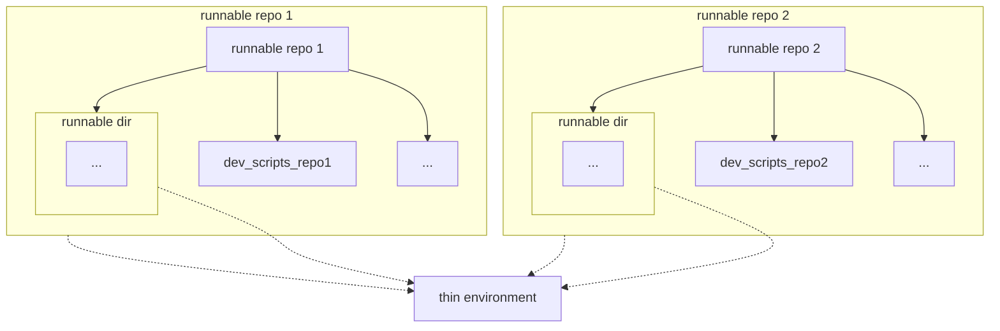
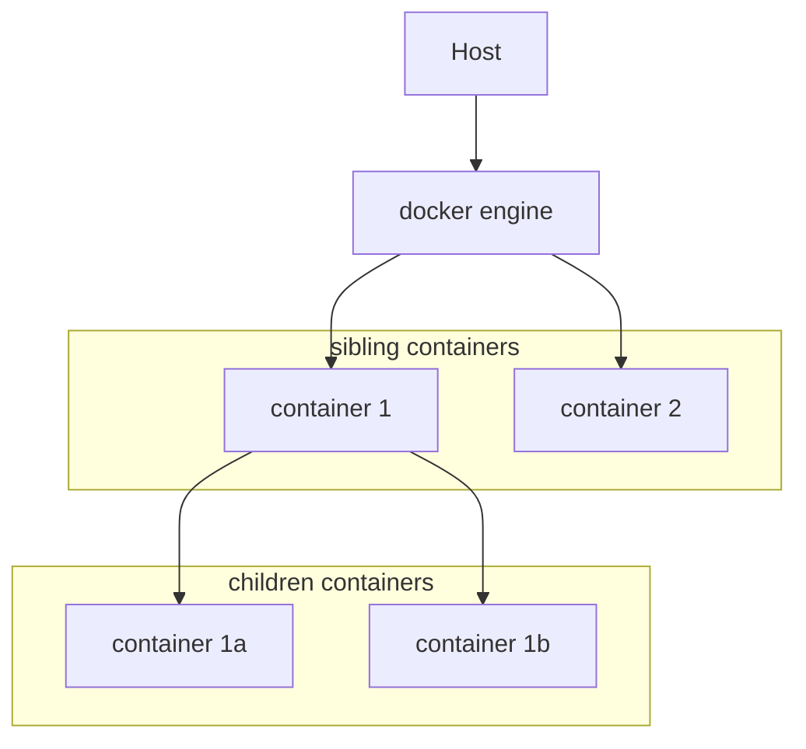

<!-- toc -->

- [Summary](#summary)
- [Design goals](#design-goals)
- [Our previous solution to the development](#our-previous-solution-to-the-development)
- [Current solution](#current-solution)
  * [Helper sub-repo](#helper-sub-repo)
  * [Runnable dir](#runnable-dir)
  * [Runnable repo](#runnable-repo)
  * [Thin environment](#thin-environment)
  * [setenv](#setenv)
  * [devops](#devops)
  * [Managing common files](#managing-common-files)
  * [Building a Docker container](#building-a-docker-container)
  * [Running a Docker container](#running-a-docker-container)
  * [pytest](#pytest)
    + [Recursive pytest](#recursive-pytest)
  * [Support for docker-in-docker and sibling-containers](#support-for-docker-in-docker-and-sibling-containers)
- [Maintaining code across different sub-repos](#maintaining-code-across-different-sub-repos)

<!-- tocstop -->

# Summary

- This document describes the design principles around our approach to create
  Git repos that contain code that can be:
  - Composed through different Git sub-repo
  - Tested, built, run, and released (on a per-directory basis or not)

# Design goals

- The development toolchain should support the following functionalities

- Standardize ways of building, testing, retrieving, and deploying containers
- Bootstrap the development system using a "thin environment", which has the
  minimum number of dependencies to allow development and deployment in exactly
  the same way in different setups (e.g., server, personal laptop, CI/CD)
- Support composing code using a GitHub sub-repo approach
- Manage dependencies in a way that is uniform across platforms and OSes, using
  Docker containers
- Separate the need to:
  - Build and deploy containers (by devops)
  - Use containers to develop and test (by developers)
- Ensure alignment between development environment, deployment, and CI/CD
  systems (e.g., GitHub Actions)
- Carefully manage and control dependencies using Python managers (such as
  `poetry`) and virtual environments
- Run end-to-end tests using `pytest` by automatically discover tests based on
  dependencies and test lists, supporting the dependencies needed by different
  directories
- Support automatically different stages for container development
  - E.g., `test` / `local`, `dev`, `prod`
- A system of makefile-like tools based on Python `invoke` package to create
  complex workflows (e.g., for testing, building
- Make it easy to add the development tool chain to a "new project" by simply
  adding a Git sub-repo to the main project and importing all the above
  functionalities
- Have a simple way to maintain common files across different repos in sync
  through links and automatically diff-ing files
- Code and containers can be versioned and kept in sync automatically since a
  certain version of the code can require a certain version of the container to
  run properly
  - Code is versioned through Git
  - Each container has a `changelog.txt` that contains the current version and
    the history
- Built-in support for multi-architecture builds (e.g, for Intel `x86` and Arm)
  across different OSes supporting containers (e.g., Linux, MacOS, Windows
  Subsystem for Linux WSL)
- Support for both local and remote development using IDEs (e.g., PyCharm,
  VSCode)
- Native support for both children-containers (i.e., Docker-in-Docker) and
  sibling containers
- Support for developing, testing, and deploying multi-container applications

# Our previous solution to the development

- Our previous approach was to create a single repo with different directories
  containing different "applications" all running in a single Docker container
  (aka `cmamp` or `dev` container)

- The main issues with this approach is that:
  - The repo is enormous and monolithic
  - There is not an easy way to have permission control over which parts of a
    repo developers have access to

- These problems got progressively worse since we want to have all the dev chain
  we are used to (thin environment, `invoke`, pytest, Docker), but since the dev
  chain was bolted on `cmamp`, we kept adding to `cmamp` instead of creating
  another repo

# Current solution

- The current solution follows the approach described below

## Helper sub-repo

- `//helpers` is the sub-repo that contains utilities shared by all the repos
  and the development toolchain (e.g., thin environment, Docker, `setenv`,
  `invoke` workflows)
- Git repos can include `//helpers` and other ones as sub-repos

  ```mermaid
  graph TD
    runnable_repo[runnable repo 1]
    runnable_repo_2[runnable repo 2]
    runnable_repo_3[runnable repo 3]

    runnable_repo --> helpers_sub_repo_1[helpers sub-repo]
    runnable_repo --> others[...]

    runnable_repo_2 --> helpers_sub_repo_2[helpers sub-repo]
    runnable_repo_2 --> others_2[...]

    runnable_repo_3 --> helpers_sub_repo_3[helpers sub-repo]
    runnable_repo_3 --> others_3[...]

    helper_repo[helper repo]
    helpers_sub_repo_1 -.-> helper_repo
    helpers_sub_repo_2 -.-> helper_repo
    helpers_sub_repo_3 -.-> helper_repo

    style helpers_sub_repo_1 fill:transparent, stroke-dasharray: 5 5
    style helpers_sub_repo_2 fill:transparent, stroke-dasharray: 5 5
    style helpers_sub_repo_3 fill:transparent, stroke-dasharray: 5 5
  ```

## Runnable dir

- A dir is runnable when it contains its own `devops` dir to have its own
  container and dependencies to develop, run, and test
  - E.g., `//cmamp/optimizer`, `//cmamp/infra`
- The code in a runnable directory or in the main repo requires a container that
  is built using the code in the corresponding `devops` dir

  ```mermaid
  graph TD
    runnable_repo[runnable repo]
    runnable_repo --> helpers_sub_repo[helpers sub-repo]
    runnable_repo --> devops[devops]
    runnable_repo --> runnable_dir_1[runnable dir 1]
    runnable_repo --> runnable_dir_2[runnable dir 2]
    runnable_repo --> runnable_dir_n[runnable dir n]
    runnable_repo --> others[...]

    runnable_dir_1 --> runnable_dir_1_devops[devops]
    runnable_dir_2 --> runnable_dir_2_devops[devops]
    runnable_dir_n --> runnable_dir_3_devops[devops]

    style helpers_sub_repo fill:transparent, stroke-dasharray: 5 5
  ```

## Runnable repo

- A runnable repo is a repo that contains a single runnable dir at the top
- A repo can contain multiple runnable dirs in a hierarchical fashion

- TODO(gp): Add a graphical depiction

## Thin environment

- Each runnable dir requires a `dev_scripts` that contains code to build the
  corresponding thin environment
- A thin environment can be shared across multiple repos and runnable
  directories since typically the dependencies needed to start the development
  containers are minimal and common



## setenv

- A `setenv` script is used to configure a shell outside and inside a Docker
  container

## devops

- A `devops` dir contains all the code needed to build and run a container for
  both development, testing, and deployment

## Managing common files

- When creating runnable repos or dirs, many files are copied from the template
  files in `//helpers`
- Some of these files are customized; however, many remain unchanged
- When changes are made to the files in `//helpers`, the corresponding files in
  their respective runnable repos or dirs need to be identified and replaced
  with the new copies
- This manual copying and comparison approach requires a lot of effort and
  becomes increasingly difficult to maintain as the number of runnable repos and
  dirs grows
- There is no way to "source control" shared files because the files themselves
  are used to create the repos

- The solution is to apply a symlink approach for all common files
- All the template files are initially copied and customized based on the
  requirements
- After customization, those that remain unchanged are deleted and replaced with
  symbolic links to the corresponding template files in `//helpers`
- If any changes are made in `//helpers`, those changes are automatically
  propagated to all the linked files
- The symlinked files should not be directly editable. If a symlinked file needs
  to be customized, it should first be staged for modification by replacing the
  symlink with a copy of the file

## Building a Docker container

- Code and tests need to be run inside a corresponding Docker container
- There is a shared toolchain to build, test, release, and deploy each Docker
  container:
  - The containers have all the dependencies to run the code
  - Each container is multi-architecture in order to be run on different
    processor architectures (e.g., x86-64, arm64)
- The same container is used to run the code in all set-ups (e.g., on a personal
  laptop, on a server, in the CI)
- The container mounts the source code as a bind-mount directory so that
  developers can use external tools to edit the code (e.g., vim, PyCharm,
  VSCode)
- A production container copies the code inside so that it contains OS
  dependencies, Python packages, and code, without any external dependency
- It is possible to have different dependencies for the dev and prod container
  - E.g., dependencies to run the unit tests are not needed in a prod container
- The toolchain to build containers is managed through `invoke` targets
  - It supports versioning
- The Python dependencies are managed to

## Running a Docker container

- Handy wrappers through the `invoke` toolchain are available to perform common
  operations, e.g.,
  - `invoke docker_bash` to start a shell inside a container

## pytest

- To run all the tests in a repo, `pytest` needs to run inside a dev container
- For top-level repo, the needed container is the top-level container
- For a runnable dir, the needed container is the one built in that specific
  directory

  ```mermaid
  graph LR
    start((start))
    start --> container
    subgraph container[container]
      direction LR
      pytest((pytest))
      pytest --> dir_1[dir 1]
      dir_1 --> dir_1a[dir 1a]
      dir_1a --> dir_1a_others[...]
      dir_1 --> dir_1b[dir 1b]
      dir_1 --> dir_1_others[...]
      pytest --> dir_2[dir 2]
      pytest --> dir_others[...]
    end
  ```

### Recursive pytest

- When we want to run all the tests in a repo containing multiple runnable dirs,
  we need to iterate over the runnable dirs and run the corresponding tests in
  the corresponding container, e.g.,

  ```bash
  for container in containers:
     (cd container; i run_fast_tests)
  ```

  ```mermaid
  graph LR
      start((start))
      start --> container_1
      start --> container_2
      start --> container_3
      start --> container_n
      subgraph container_1[container 1]
          direction LR
          pytest_1((pytest)) --> runnable_dir1[runnable dir 1]
      end
      subgraph container_2[container 2]
          direction LR
          pytest_2((pytest)) --> runnable_dir2[runnable dir 2]
      end
      subgraph container_3[container 3]
          direction LR
          pytest_3((pytest)) --> runnable_dir3[runnable dir 3]
      end
      subgraph container_n[container n]
          direction LR
          pytest_n((pytest)) --> runnable_dir_n[runnable dir n]
      end
  ```

- This function is performed automatically by the script `main_pytest.py`
  ```bash
  > main_pytest.py --dir infra
  ```

## Support for docker-in-docker and sibling-containers



# Maintaining code across different sub-repos

- TODO(gp): Explain
